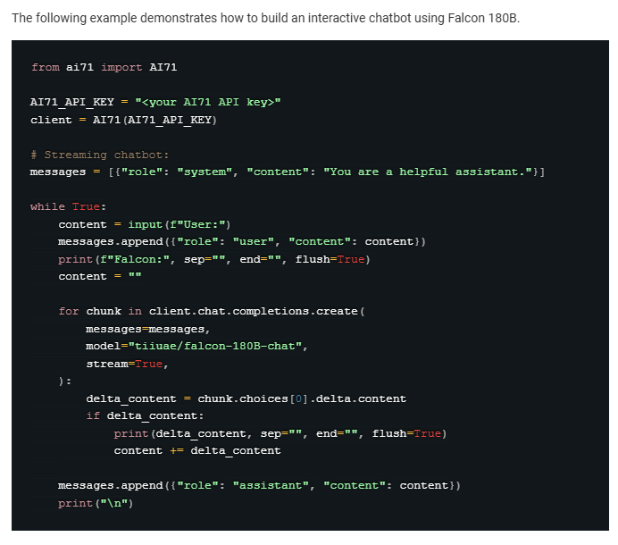

<p align="center">
  
</p>
<p align="center">
  <a href="https://ko-fi.com/theborch"></a>
  <a href="https://discord.gg/dAzSYcnpdF"></a>
</p>

# 🦅Math Wings🦅

## About
Math wings is a personal math research assistant user requests the agent to research relevant math papers with arxiv api, then combines it with their personal math paper data and research, to compile the entire latex paper

Math wings is built on top of Ai71's Falcon API, providing it with both a Rag, and an Agentic Framework for compiling research data, constructing latex solutions and providing access to plotting software automations for writing latex papers.

<p align="center">
  
</p>

# installing
0. Install Miniconda
   
[miniconda install](https://docs.anaconda.com/miniconda/)

```
conda create -n ai71 python=3.11.9
```

To get started with Math Wings execute the following steps:

1. clone the repo
```
git clone https://github.com/Leoleojames1/Math_Wings.git
```

2. copy template from:
```
math_wings/program/developer_tools/FALCON_API_KEY_template.json
```

move to program folder and replace placeholder string with API key
```
math_wings/program/FALCON_API_KEY.json
```

3. install python packages:
```
conda activate ai71
cd math_wings/program
pip install -r requirements.txt
``` 
